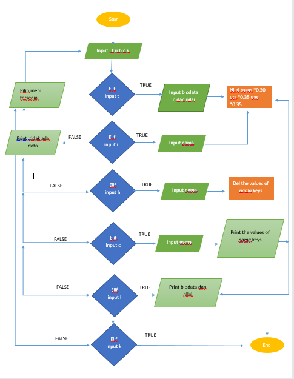
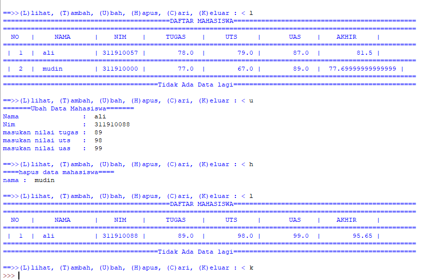
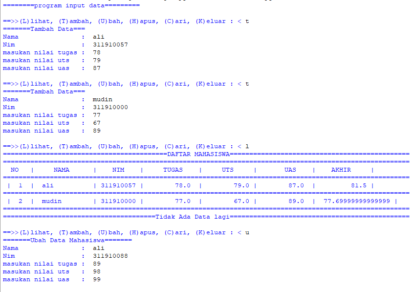

# Praktikum5

## Tugas pertemuan ke 10 Bahasa Pemrograman

## Nama : Ramadhan Ardi Iman Prakoso

## NIM : 312210722

## Kelas : TI.22.C.9

## Prodi : Teknik Informatika

# Program Input Nilai Mahasiswa

1. program dibuat menggunakan dictionary
2. akan disediakan beberapa pilihan, nantinya pengguna dapat memilih menu yang tersedia seperti L,T,U,H,C,K
3. dengan menggunakan elemen elif dan if atau percabangan
4. jika ketik t (tambah) maka user akan diminta untuk memasukan biodata beserta nilai2 nya perolehan nilai dari akumulasi antara tugas x 0.30 uts x 0.35 uas x 0.35
5. jika ketik u (ubah) maka user akan diminta memasukan nama if nama adalah keys dari dictionary data maka akan diminta mengisi kembali yang akan di ganti,
6. jika ketik h maka user akan diminta menginputkan nama if nama adalah keys maka akan terhapus semua values nya juga
7. jika ketik c (cari) user akan diminta menginputkan nama if nama adalah keys maka akan tercetak values2 nya
8. jika ketik l (lihat) maka akan ditampilkan semua data yang di input beserta nilai nilainya dalam bentuk tabel
9. jika ketik k (keluar) maka user akan keluar dari program.

## Flowchart

## Hasil Uji Program

# S E L E S A I